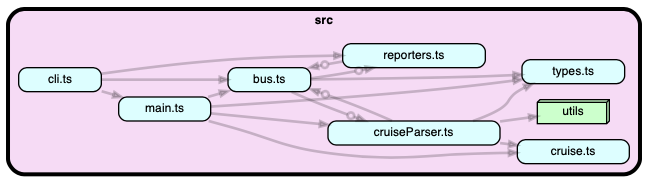

# dependency-cruising

Generate interactive HTML dependency diagrams, like this:

[](https://google.com)
_Click the nodes to traverse the dependency tree._

---
This is an easy-to-use and opinionated Docker wrapper around the amazing
[dependency cruiser](https://github.com/sverweij/dependency-cruiser) tool.

## Usage

To run dependency-cruising you'll need Docker. Let's start with the basics, here's how to run the CLI and see its help:

```bash
$ docker run --rm jonlauridsen/dependency-cruising --help
  Usage
    $ dependency-cruising [-o output] <files_to_scan>

  Options
    --output, -o  Directory to output dependency report

  Examples
    $ dependency-cruising .
    $ dependency-cruising -o ./foo .
    $ dependency-cruising src/services
```

But to really make use of dependency-cruising you'll need to give it access to your codebase, otherwise it'll have
nothing to scan!

To do that we need to run Docker in a way that passes your local files into the Docker process. So to actually scan your
codebase you can this command:

```bash
$ docker run --rm --user "$(id -u):$(id -g)" -v "$(pwd)":/code -w /code jonlauridsen/dependency-cruising .
```

In this example we added these Docker arguments:

* `--rm` stands for "remove", and it means the container will automatically remove itself when it exits. This is a
  common argument used most places you run Docker containers.

* `--user "$(id -u):$(id- g)"` - This passes your user id and group to Docker such that the process inside has the same
  permissions as your current user. This way the Docker process can create the interactive layered HTML report so it has
  the same permissions as you do.
  (by default the Docker process is root, so if you run without `--user`
  then dependency-cruising will create files your user won't necessarily be able to read, move, or delete).

* `-v "$(pwd)":/code -w /code` - The `-v` maps your current working directory into the Docker-process's `/code` folder,
  and `-w` sets the Docker process' current working directory to `/code`. This way the Docker process can run its
  internal commands, and they will behave as if you were running them natively on your machine.

* The `.` at the end tells dependency-cruising that you wish to scan your current directory. You could also put
  here `src` or `lib/core/foo` or whatever folder you want to scan.

The default behaviour of dependency-cruising is to output the report to a folder named `./dependency-report`, but you
can specify that with the `--output` argument.
